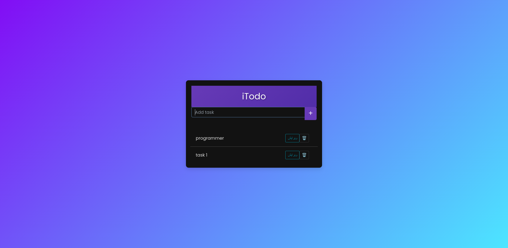

# 🗒️ iTodo

**A simple and effective To-Do List application built with Django, Docker, and Vanilla JavaScript** 📋🚀

**Producer:** AminKhanmohamadi  
**Email:** [📧 aminkhm097@gmail.com](mailto:aminkhm097@gmail.com)  
**GitHub:** [AminKhanmohamadi](https://github.com/AminKhanmohamadi/iTodo.git)

---

## Table of Contents

1. [Introduction](#introduction)
2. [Features](#features)
3. [Technologies Used](#technologies-used)
4. [Getting Started](#getting-started)
5. [Usage](#usage)
6. [Contributing](#contributing)
7. [License](#license)

---

## Introduction

iTodo is designed to help users efficiently manage their tasks. Built with Django for the backend, Vanilla JavaScript for the frontend, and Docker for seamless development and deployment, iTodo offers a simple yet powerful task management experience.

## Features

- **User-Friendly Interface**: A clean and intuitive UI for easy task management.
- **Responsive Design**: Optimized for all screen sizes.
- **Real-time Updates**: Keeps the task list current with instant changes.
- **Secure and Efficient**: Django ensures data security and performance.
- **Dockerized Environment**: Simplifies development and deployment with containerization.

## Technologies Used

- **Django**: A high-level Python web framework.
- **Vanilla JavaScript**: Ensures fast and responsive interactions.
- **Bootstrap**: Provides a sleek and responsive UI.
- **Docker**: Facilitates containerized development and deployment.

## Getting Started

To get a local copy up and running, follow these steps:

### Prerequisites

- Python 3.6 or higher
- pip (Python package installer)
- Docker & Docker Compose

### Installation

1. Clone the repository from GitHub:
   ```sh
   git clone https://github.com/AminKhanmohamadi/iTodo.git
   ```
2. Navigate into the project directory:
   ```sh
   cd iTodo
   ```
3. Build and run the Docker container:
   ```sh
   docker-compose up --build
   ```

The application will be available at `http://localhost:8000`.

---

## Usage

- Open the application in your browser.
- Add, edit, and delete tasks as needed.
- Enjoy seamless task management with iTodo.

## Contributing

Contributions are welcome! Feel free to submit pull requests or open issues on GitHub.

## License

This project is licensed under the MIT License.

---



